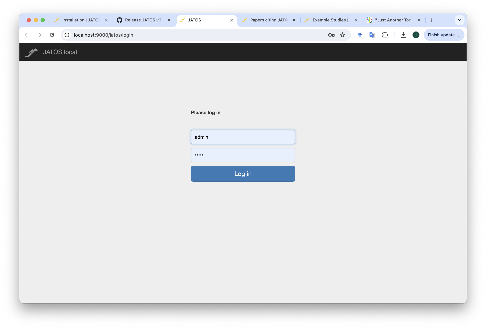
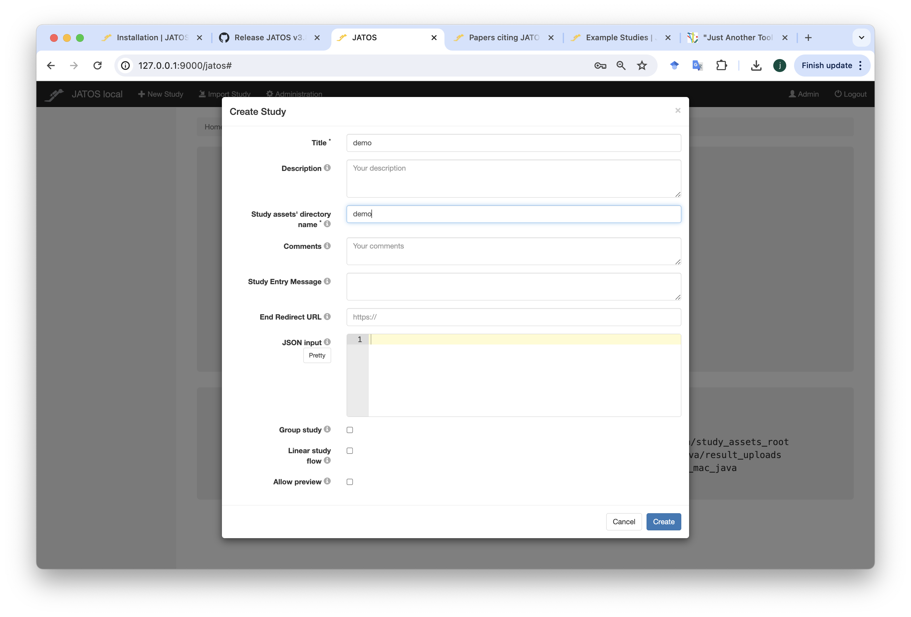
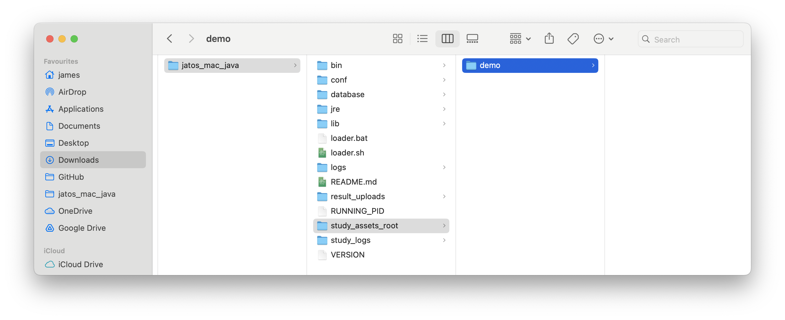
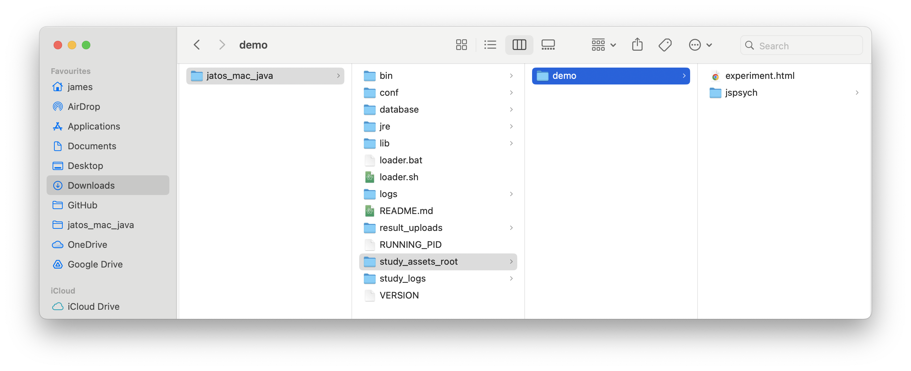
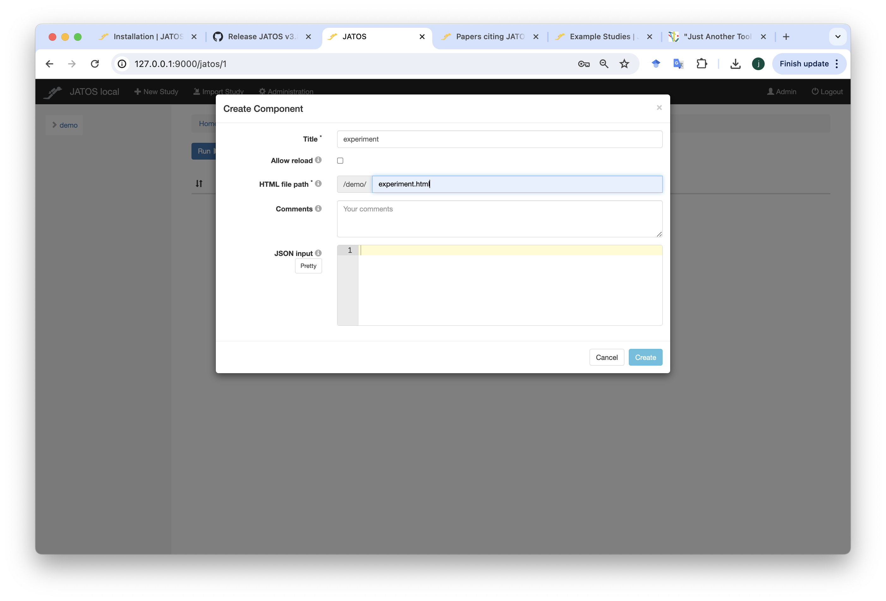
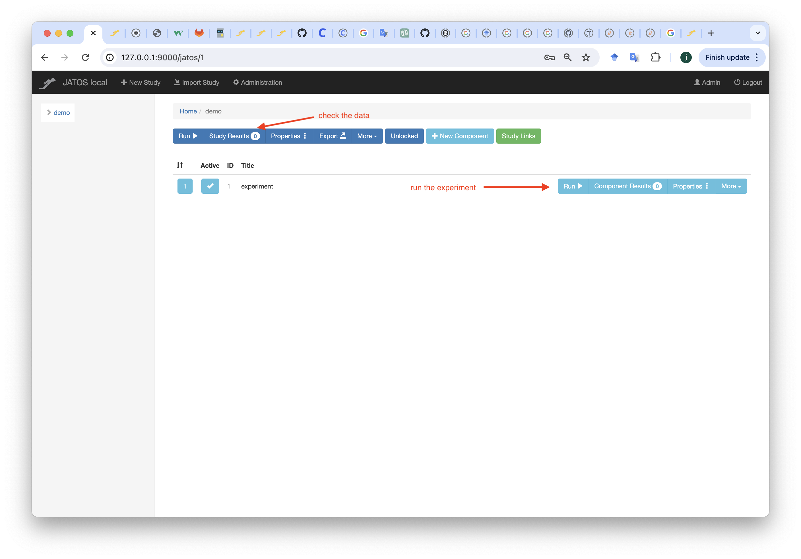
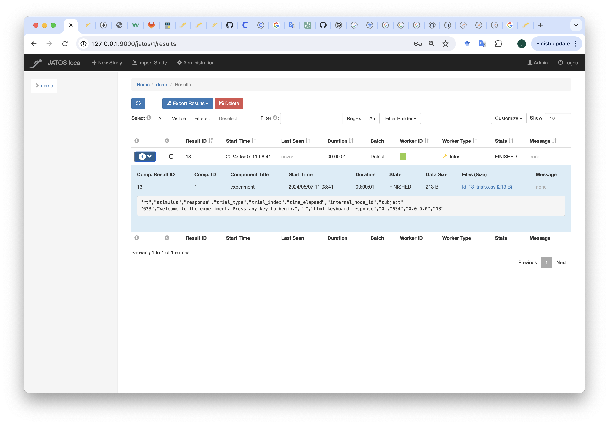
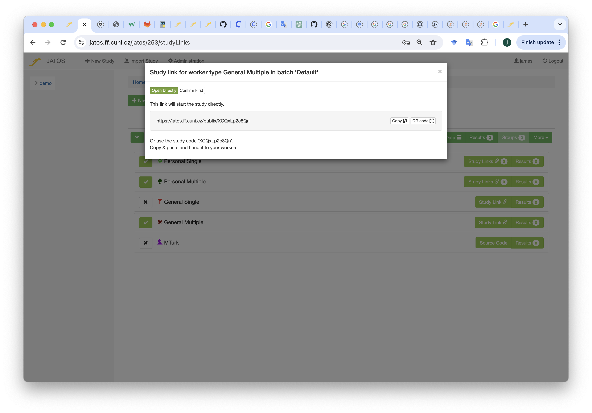

```{r echo=FALSE, warning=FALSE}
library(slickR)
library(htmltools)
library(xaringanExtra)
library(rmarkdown)
library(fontawesome)
library(bsplus)
library(DT)

```

```{r setup, warning=FALSE, echo=FALSE}
knitr::opts_chunk$set(echo = TRUE,
                      eval = FALSE,
                      comment = NA,
                      message = FALSE,
                      warning = FALSE)

knitr::knit_hooks$set(
  message = function(x, options) {
     paste('<button type="button" class="collapsible1"><strong>',
     fa(name = "circle-info"),
     ' more info</strong></button>', '<div class="content1"><p>',
     gsub('##', '\n', x),
     '</p></div>',
     sep = '\n')
   })

codeblock = function(x, options) {
     cat(paste('<div class="codeblock">',
     paste0(x),
     '</div>',
     sep = '\n'))
   }

```

---

## `r fa("language")` Translations available

Disclaimer: may not be very accurate...

<div id="google_translate_element"></div>

---

# Worksheet overview

## `r fa("crosshairs")` Aims

By the end of this worksheet you should be able to:

- **program** your own experiments in jsPsych
- **host** the experiment online using cognition.run
- **use** the participant data for analysis
- **apply** the basic skills you have learnt for your own purposes
- **learn** some extra skills such as HTML, javascript, CSS and JSON

## `r fa("user-graduate")` Pre-requisites

To complete the aims you will need to:

- **follow** this worksheet
- **ask** questions if you are not sure/be able to google
- **have** a working computer and internet connection
- **be patient** when things do not work

You do not need to:

- have any **programming knowledge**
- have high **computer literacy**
- know anything about **jsPsych, cognition.run, html, css or javascript**
- be a **linguist**

## `r fa("folder-tree")` Structure

The worksheet will go through the following sections:

    - working with JATOS
    - working with piloting on a local server
    - working with the FF server

## `r fa("lightbulb")` Recap

In the last session we should have:

    - made a html experiment
    - load in JS scripts
    - used local files for JsPsych

---

# What is JATOS

Just Another Tool for Online Studies (JATOS) is an application that allows researchers to easily host experiments on a server. It allows for pilotting, storage of data, creation of url links and lots of other things.

It is an easy way to get your experiment online.

# How to use it

JATOS works through a graphical user interface, meaning you need to know where to click to make things work.

Typically this is a standard workflow:

1. Write your experiment using a working directory, i.e. have an `experiment.html` file, a folder with `JsPsych`, `stimuli` or anything else you need to make the experiment run

2. Make sure the experiment works through your browser

3. Edit your html code so that it works with JATOS

4. Pilot this through a local instance of JATOS

5. Check the data looks alright

6. Export the experiment files as a .`jzip` and import it to the main server

7. Distribute links to participants

8. Download your data

# Local instance of JATOS

Follow the instructions for downloading a local instance of JATOS

https://www.jatos.org/Installation.html

Make sure the folder called `jatos_mac_java` or `jatos_win_java` is somewhere on your computer that is sensible. It will be important to find and use the folder later.

## Log in

Now you should be able to access the log in page on your browser, log in using `admin` as the username and `admin` as the password.

This is a local instance, so it is not accessible to anybody other than you on your computer, it is not like accessing Google.



## New study

In the top left of the page there should be a button called `+ new study`, click on it and you see this screen



Now we need to fill in two pieces of information:

For the `title` option, call it `demo`, this will be the name of the experiment

For the `Study assets' directory name` also call it `demo`, this will be the name of the folder where all your experiment files will be

Click `create`

## study_assets_root

Go back to the `jatos_mac_java` or `jatos_win_java` folder.

Find the sub folder called `study_assets_root` this is the main folder you will need to use when working with JATOS locally.

It is where your experiment directories will be.

Every time you create a new study, JATOS will create a folder based on what on you call the `Study assets' directory name`.

You should see a folder called `demo` as we created this.



There is nothing in this folder yet but we can add any experiment files needed to the folder.

From the last worksheet, we created a `experiment.html` file, that loaded scripts from a `jspsych` folder.

Add these to your `demo` folder in the `study_assets_root`.



## Modifications for html files with JATOS

There are a few edits that need to be made to your `experiment.html` file in order to make it compatible with JATOS.

This is how our file looks now:

```{html}
<!DOCTYPE html>
<html>
<head>
  <title>Page Title</title>
  <script src="jspsych/dist/jspsych.js"></script>
  <script src="jspsych/dist/plugin-html-keyboard-response.js"></script>
  <link href="jspsych/dist/jspsych.css" rel="stylesheet" type="text/css" />
</head>
<body>
</body>

<script>
  
// inititate jspsych
var jsPsych = initJsPsych();

// start timeline
timeline = [];

// define welcome message trial
var welcome = {
  type: jsPsychHtmlKeyboardResponse,
  stimulus: "Welcome to the experiment. Press any key to begin."
};

// push to timeline
timeline.push(welcome);

//run the experiment
jsPsych.run(timeline);

</script>

</html>

```

The following edits need to be made for it run:

### 1. jatos.js

We need to a script that loads in `jatos.js`:

```{html}
<script src="jatos.js"></script>

```

Put this where you load in the other scripts, e.g. on a line after you load in `jspsych.js`

This file is not visible in the directory but it is loaded by jatos, so you do not need to see the actual file for this to work.

### 2. initJsPsych

We also need to edit the way jspsych is initiated.

Currently we have:

```{js}
var jsPsych = initJsPsych();

```

We need to modify this so that JATOS can save the data after each trial:

```{js}
var jsPsych = initJsPsych(
  {
    on_trial_finish: function(data) {
      var subjectID = jatos.studyResultId;
      jsPsych.data.addProperties({subject: subjectID});
      jatos.uploadResultFile(jsPsych.data.get().csv(), "Id_" + subjectID + "_trials.csv")
    },
    on_finish: function() {
      jatos.endStudy(jsPsych.data.get().csv());
    }
  }
);

```

The code does the following:

- `on_trial_finish: function(data)` runs a function after every trial in the experiment has been finished. The following parts within the `{ }` are what the function does

- `var subjectID = jatos.studyResultId;` makes a subject ID based on a JATOS assigned value

- `jsPsych.data.addProperties({subject: subjectID});` adds the subjectID variable to the data as a column called `subject`

- `jatos.uploadResultFile(jsPsych.data.get().csv(), "Id_" + subjectID + "_trials.csv")` uploads the data as a `.csv` file, the name of the file will be `ID_x_trials.csv` where x is the subject ID

- `on_finish: function()` runs a function at the very end of the experiment

- `jatos.endStudy(jsPsych.data.get().csv());` ends the study and adds the data to JATOS

### 3. jsPsych.run

We also need to change the way the timeline is run. Currently we have:

```{js}
jsPsych.run(timeline);

```

We need to change this to be compatible with JATOS:

```{js}
jatos.onLoad(() => {
  jsPsych.run(timeline);
});

```

### Final code

This is the final code. Save it as `experiment.html` in the `demo` folder.

```{html}
<!DOCTYPE html>
<html>
<head>
  <title>Page Title</title>
  <script src="jspsych/dist/jspsych.js"></script>
  <script src="jatos.js"></script>
  <script src="jspsych/dist/plugin-html-keyboard-response.js"></script>
  <link href="jspsych/dist/jspsych.css" rel="stylesheet" type="text/css" />
</head>
<body>
</body>

<script>

// inititate jspsych
var jsPsych = initJsPsych(
  {
    on_trial_finish: function(data) {
      var subjectID = jatos.studyResultId;
      jsPsych.data.addProperties({subject: subjectID});
      jatos.uploadResultFile(jsPsych.data.get().csv(), "Id_" + subjectID + "_trials.csv")
    },
    on_finish: function () {
      jatos.endStudy(jsPsych.data.get().csv());
    }
  }
);

// start timeline
timeline = [];

// define welcome message trial
var welcome = {
  type: jsPsychHtmlKeyboardResponse,
  stimulus: "Welcome to the experiment. Press any key to begin."
};

// push to timeline
timeline.push(welcome);

//run the experiment
jatos.onLoad(() => {
  jsPsych.run(timeline);
});

</script>

</html>

```

## Components

We now need to set up a component so that JATOS can load in the `experiment.html` file.

On the JATOS dashboard for the demo experiment there should be a light blue button called `+ new component`, click on this and there will be the following:



Make the `title` called `experiment`

Make the `HTML file path` called `experiment.html`

Click `create`

You should now see the `experiment` component in the dashboard

Click `run` to test the experiment works



## Data

Once you have tried the experiment, return back to the dashboard.

There will be a button called `Study Results` click on this to see the data:



You can download the data by clicking on the `Export Results` button, choosing `Files only`

This will give you all the .csv files as a .zip folder.

## Exporting

Once you are happy with the experiment and are sure that the data are coded in a useable way, you can now export it from the local JATOS server.

Return to the `demo` dashboard.

Click on the `Export` button.

You will now have a `demo.jzip` file downloaded.

# JATOS FF server

We will now need to host the experiment on the JATOS FF server. This is not a local server, but one that can be accessed by anybody with a login.

Go to this link:

https://jatos.ff.cuni.cz/jatos/login

Log in with the following:

Username: your surname in lowercase without diacritics, e.g. if your name is Jan Chromý, the username will be `chromy`

Password: your username with jatos at the end, e.g. chromyjatos

You can change the password once you log in

## Import study

At the top of the dashboard there is the option to `import study`.

Import your `demo.jzip` file.

You should now see it in the dashboard.

## Running and data

Everything on the FF JATOS server works the same. If you want to run the experiment to test it works, click `Run`.

To download the data, go to `Study Results`, click `Export files` then choose `All`.

## Links

To get a link for your experiment to send out to participants:

1. Click on the green `Study Links` button

2. Select `General Multiple`

3. Click `Study Link`

4. Copy the link displayed in the box




```{r echo=FALSE, eval=TRUE, warning=FALSE}
htmltools::tags$script(src = "js/translate.js")
# htmltools::tags$script(src = "js/infobox.js")
htmltools::tags$script(src="//translate.google.com/translate_a/element.js?cb=googleTranslateElementInit")

htmltools::tagList(
  xaringanExtra::use_clipboard(
    button_text = "<i class=\"fa fa-clipboard\" style=\"font-size: 25px\"></i>",
    success_text = "<i class=\"fa fa-check\" style=\"color: #90BE6D; font-size: 25px\"></i>",
  ),
  rmarkdown::html_dependency_font_awesome()
)

```

```{js echo=FALSE, eval=TRUE}
var coll = document.getElementsByClassName("collapsible1");
var i;

for (i = 0; i < coll.length; i++) {
  coll[i].addEventListener("click", function() {
    this.classList.toggle("active1");
    var content = this.nextElementSibling;
    if (content.style.maxHeight){
      content.style.maxHeight = null;
    } else {
      content.style.maxHeight = content.scrollHeight + "px";
    }
  });
}

```
