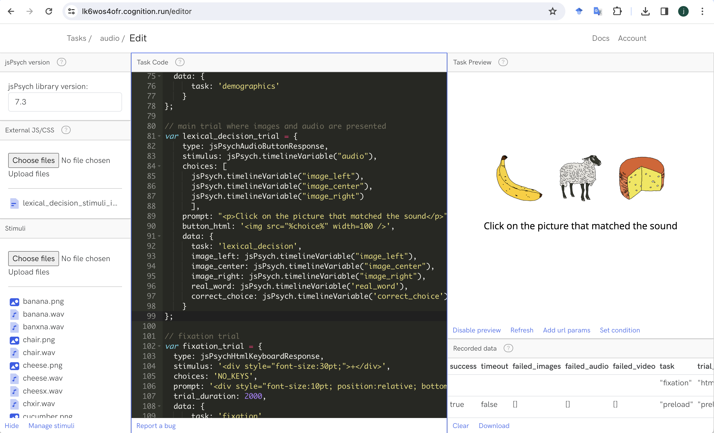
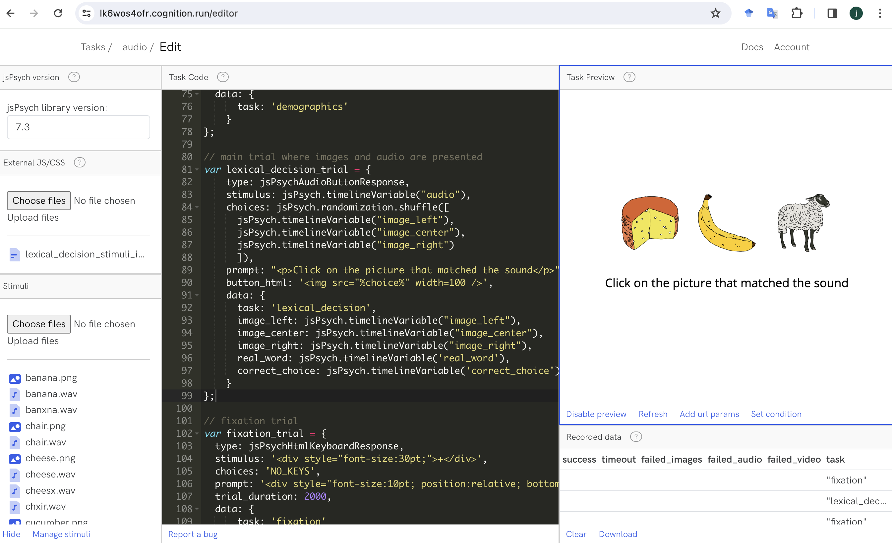
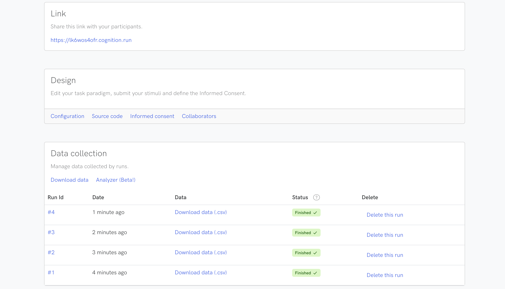
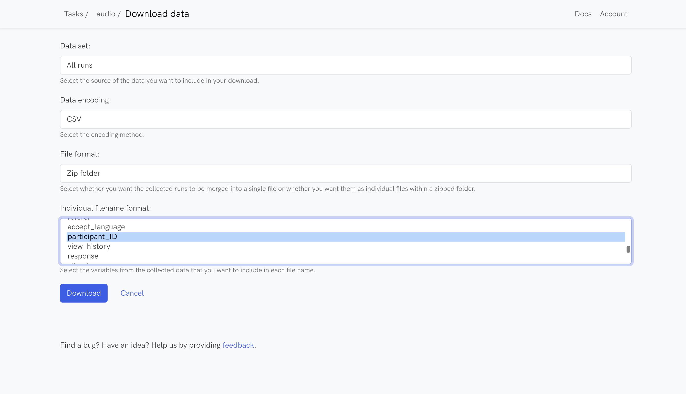
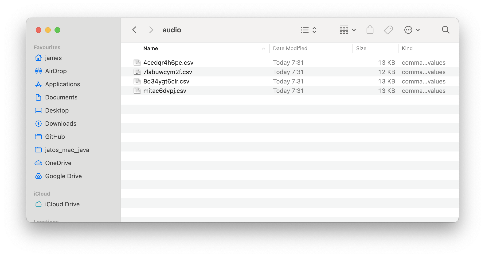

```{r echo=FALSE, warning=FALSE, eval=TRUE}
library(tidyverse)
library(jsonlite)
library(slickR)
library(htmltools)
library(xaringanExtra)
library(rmarkdown)
library(fontawesome)
library(bsplus)
library(DT)

```

```{r setup, warning=FALSE, echo=FALSE}
knitr::opts_chunk$set(echo = TRUE,
                      eval = FALSE,
                      comment = NA,
                      message = FALSE,
                      warning = FALSE)

knitr::knit_hooks$set(
  message = function(x, options) {
     paste('<button type="button" class="collapsible1"><strong>',
     fa(name = "circle-info"),
     ' more info</strong></button>', '<div class="content1"><p>',
     gsub('##', '\n', x),
     '</p></div>',
     sep = '\n')
   })

codeblock = function(x, options) {
     cat(paste('<div class="codeblock">',
     paste0(x),
     '</div>',
     sep = '\n'))
   }

```

---

## `r fa("language")` Translations available

Disclaimer: may not be very accurate...

<div id="google_translate_element"></div>

---

# Worksheet overview

## `r fa("crosshairs")` Aims

By the end of this worksheet you should be able to:

- **program** your own experiments in jsPsych
- **host** the experiment online using cognition.run
- **use** the participant data for analysis
- **apply** the basic skills you have learnt for your own purposes
- **learn** some extra skills such as HTML, javascript, CSS and JSON

## `r fa("user-graduate")` Pre-requisites

To complete the aims you will need to:

- **follow** this worksheet
- **ask** questions if you are not sure/be able to google
- **have** a working computer and internet connection
- **be patient** when things do not work

You do not need to:

- have any **programming knowledge**
- have high **computer literacy**
- know anything about **jsPsych, cognition.run, html, css or javascript**
- be a **linguist**

## `r fa("folder-tree")` Structure

The worksheet will go through the following sections:

    - working with randomisation
    - working with data
    - working with R to process your data

## `r fa("lightbulb")` Recap

In the last session we should have:

- Use audio and visual stimuli together
- preload our stimuli
- create a fully working experiment

---

<!-- # Working with results files in R -->

<!-- ## loading in multiple files quickly -->

<!-- ## getting information from different parts of the experiment -->

<!-- ## converting json formatted data to columns -->

# Randomisation of positions

One thing that might be useful for an experiment is to completely randomise the position of the stimuli on the screen. In the previous worksheet, we presented three images on the screen, which was predefined in our stimuli file. E.g.



But if we want to fully randomise the order for each participant and trial, we can use some code to make this work.

In JsPsych there are predefined functions we can use that help with randomisation:

`jsPsych.randomization.shuffle` can be used to shuffle an array.

e.g. if we have `[image1, image2, image3]`, it will present the images in the set order. But if we modify the code to be `jsPsych.randomization.shuffle([image1, image2, image3])` we should get a randomised version of this array, e.g. `[image3, image2, image3]`.

We can demonstrate this by modifying the `lexical_decision_trial` var in our experiment:

```{js}
var lexical_decision_trial = {
    type: jsPsychAudioButtonResponse,
    stimulus: jsPsych.timelineVariable("audio"),
    choices: jsPsych.randomization.shuffle([
      jsPsych.timelineVariable("image_left"),
      jsPsych.timelineVariable("image_center"),
      jsPsych.timelineVariable("image_right")
      ]),
    prompt: "<p>Click on the picture that matched the sound</p>",
    button_html: '',
    data: {
      task: 'lexical_decision',
      image_left: jsPsych.timelineVariable("image_left"),
      image_center: jsPsych.timelineVariable("image_center"),
      image_right: jsPsych.timelineVariable("image_right"), 
      real_word: jsPsych.timelineVariable('real_word'),
      correct_choice: jsPsych.timelineVariable('correct_choice')
    }
};

```

Now, we should see that the images are randomised in terms of their position, i.e. left, center, right.


However, we now have a problem as we do not know which response is the correct one.

In our stimuli file we explicitly coded the image positions as either left, center, or right. But if we randomise the locations, we lose this information and there is no logging of the order in our data file.

To resolve this we have to adapt our code so that JsPsych logs the order of the images for each trial. We can do this by adding a new parameter to our var:

```{js}
save_trial_parameters: {
    choices: true
  }
  
```

This `save_trial_parameters` parameter will allow us to save any information that is used in our trial. By specifying `choices: true` we are telling JsPsych to add a new variable to our data that will contain the information used in the `choices` parameter.

It will look something like this:

`["cheese.png","banana.png","sheep.png"]`

This provides us with the information about the order in which the images were presented, i.e. the left image was the cheese, the center image the banana and the right image the sheep.

Remember that when a participant makes a choice in this trial, their response will be logged as either `0`, `1`, or `2`, where 0 = left, 1 = center, and 2 = right. In our stimuli file we now have the incorrect value as the positions are randomised, so our `correct_choice` variable is not longer accurate.

To deal with this we should first create a new stimuli file.

Note we have changed the first three columns so that they do not indicate a position, we have also changed the correct_choice so that it refers to the image, not the index of the image.

Save this file as `lexical_decision_stimuli_image_audio_updated.csv`

```{r echo=FALSE, eval=TRUE, warning=FALSE}
datatable(data.frame(image1 = c("fox.png", "cheese.png", "sheep.png", "banana.png", "chair.png", "pea.png", "heart.png", "pumpkin.png", "cucumber.png", "hippo.png"),
                     image2 = c("hippo.png", "fox.png", "cheese.png", "sheep.png", "banana.png", "chair.png", "pea.png", "heart.png", "pumpkin.png", "cucumber.png"),
                     image3 = c("cucumber.png", "hippo.png", "fox.png", "cheese.png", "sheep.png", "banana.png", "chair.png", "pea.png", "heart.png", "pumpkin.png"),
                     audio = c("fox.wav", "cheesx.wav", "sheep.wav", "banxna.wav", "banana.wav", "chxir.wav", "pea.wav", "pxa.wav", "heart.wav", "pumpkxn.wav"),
                     real_word = c("yes", "no", "yes", "no", "yes", "no", "yes", "no", "yes", "no"),
                     correct_choice = c("fox.png", "cheese.png", "sheep.png", "banana.png", "banana.png", "chair.png", "pea.png", "pea.png", "heart.png", "pumpkin.png")), rownames = FALSE, filter = "none", autoHideNavigation = TRUE, options = list(dom = 't', pageLength = 10))

```

Now we can process this file to a `.js` using the R code:

```{r}
paste0("var stimuli = ",
       toJSON(read_delim("lexical_decision_stimuli_image_audio_updated.csv"),
              pretty=TRUE),
       ";") %>%
  write_file(file = "lexical_decision_stimuli_image_audio_updated_JSON.js")

```

Then we upload it to cognition.run.

Remember to modify your code to replace `image_left` with `image1`, `image_center` with `image2`, and `image_right` with `image3`.

Our `lexical_decision_trial` code should look like this:

```{js}
var lexical_decision_trial = {
    type: jsPsychAudioButtonResponse,
    stimulus: jsPsych.timelineVariable("audio"),
    choices: jsPsych.randomization.shuffle([
      jsPsych.timelineVariable("image1"),
      jsPsych.timelineVariable("image2"),
      jsPsych.timelineVariable("image3")
      ]),
    prompt: "<p>Click on the picture that matched the sound</p>",
    button_html: '',
    data: {
      task: 'lexical_decision',
      image1: jsPsych.timelineVariable("image1"),
      image2: jsPsych.timelineVariable("image2"),
      image3: jsPsych.timelineVariable("image3"),
      real_word: jsPsych.timelineVariable('real_word'),
      correct_choice: jsPsych.timelineVariable('correct_choice')
    },
  save_trial_parameters: {
    choices: true
  }
};

```

Our `preload` code for pushing images should look like this:

```{js}
for (let i = 0; i < stimuli.length; i++) {
  all_images.push(stimuli[i].image1);
  all_images.push(stimuli[i].image2);
  all_images.push(stimuli[i].image3);
};

```

# Adding a participant ID

If we want to ensure that we can identify out participants as unique individuals, in an anonymised way so that their email address or other demographic information does not need to be shared, we need to add a participant ID to our data.

We can do this with the following code:

```{js}
jsPsych.data.addProperties({participant_ID: Math.random().toString(36).slice(2)});

```

This is what the code does:

`jsPsych.data.addProperties` is a built in JsPsych function that can add variables to all of your rows of data

`participant_ID` is the name of the variable we will be adding to the data, this is your decision and can be anything that is considered a suitable variable name, i.e. do not use spaces

`Math.random()` is how we will generate a random alpha-numeric string. 'Math' is a built in javascript way to use math related parameters, e.g. if you want to get the value of pi you can use Math.PI. If we use Math.random() it will create a random number < 1 and > 0

`.toString(36)` is the way we can convert the random number to a value that contains both numeric and alpha characters e.g. instead of 0.12345 it will be 0.1a2b3. The '36' is important, this identifies the types of characters we will have when converting to a string, it is 36 as that is the way to declare base-36, which is just a way to say only include [0-9] and [a-z] values

`.slice(2)` is how we can remove the first two characters of the string, i.e. the '0.' which is there as Math.random is always < 1

The result will be something like `59f4zwpglkk`

I would personally add this code towards the beginning of your script, e.g. after you declare `var jsPsych = initJsPsych()`

# The full experiment

The full experiment code should look like this:

```{js}
// --------
// Title: Demo experiment
// jsPsych version: 7.3.1
// date: [today]
// author: [your name]
//----------

// inititate jspsych
var jsPsych = initJsPsych();

jsPsych.data.addProperties({participant_ID: Math.random().toString(36).slice(2)});

// full screen
var enter_fullscreen = {
  type: jsPsychFullscreen,
  fullscreen_mode: true,
  message: '<p>some message</p>',
  button_label: 'enter full screen mode',
  data: {
      task: 'fullscreen'
    }
};

// a really simple instructions page with a logo
var instructions_page = {
    type: jsPsychInstructions,
    pages: [
    '</br><hr><div style="text-align: left; margin-right: 150px; margin-left: 150px;"><h2>Instructions</h2><p>In this experiment you will see a word on the screen.</p><p><b>If you think the word is a real word press the "d" key, if you do not think it is a real word, press the "h" key.</b></p><p>Press next to continue.</div>',
    'In this experiment you will...'
    ],
    show_clickable_nav: true,
    key_forward: 'Enter',
    key_backward: 'ArrowLeft',
    allow_backward: true,
    show_clickable_nav: true,
    button_label_previous: 'back',
    button_label_next: 'next',
  data: {
      task: 'instructions'
    }
};

// a really bad consent form page
var consent_page = {
    type: jsPsychInstructions,
    pages: [
    'Details of informed consent...',
    ],
    show_clickable_nav: true,
    allow_backward: false,
    button_label_next: 'I consent to participating in this experiment',
  data: {
      task: 'consent'
    }
};

// a demographics page that is very bad
var demographics_page = {
  type: jsPsychSurveyHtmlForm,
  html: '<div style="text-align: left;">'+
  '<p>Question 1 </p><input id="Q1" name="Q1" type="text" required/>'+
  '<p>Question 2 </p><input id="Q2" name="Q2" type="number" />'+
  '<p>Question 3 </p><input id="Q3" name="Q3" type="email" />'+
  '<p>Question 4</p>'+
  '<input type="radio" id="Q4" name="Q4" value="a"><label>a</label><br>'+
  '<input type="radio" id="Q4" name="Q4" value="b"><label>b</label><br>'+
  '<input type="radio" id="Q4" name="Q4" value="c"><label>c</label><br>'+
  '<p>Question 5</p>'+
  '<input type="checkbox" id="Q5" name="Q5" value="a"><label>a</label><br>'+
  '<input type="checkbox" id="Q5" name="Q5" value="b"><label>b</label><br>'+
  '<input type="checkbox" id="Q5" name="Q4" value="c"><label>c</label><br>'+
  '<p>Question 6</p>'+
  `<textarea id="feedback_comments" name="feedback_comments" rows="4" cols="50"/></textarea>`+
  '</br></div>',
  button_label: 'next',
  autofocus: 'Q1',
  data: {
      task: 'demographics'
    }
};

// main trial where images and audio are presented
var lexical_decision_trial = {
    type: jsPsychAudioButtonResponse,
    stimulus: jsPsych.timelineVariable("audio"),
    choices: jsPsych.randomization.shuffle([
      jsPsych.timelineVariable("image1"),
      jsPsych.timelineVariable("image2"),
      jsPsych.timelineVariable("image3")
      ]),
    prompt: "<p>Click on the picture that matched the sound</p>",
    button_html: '',
    data: {
      task: 'lexical_decision',
      image1: jsPsych.timelineVariable("image1"),
      image2: jsPsych.timelineVariable("image2"),
      image3: jsPsych.timelineVariable("image3"),
      real_word: jsPsych.timelineVariable('real_word'),
      correct_choice: jsPsych.timelineVariable('correct_choice')
    },
  save_trial_parameters: {
    choices: true
  }
};

// fixation trial
var fixation_trial = {
  type: jsPsychHtmlKeyboardResponse,
  stimulus: '<div style="font-size:30pt;">+</div>',
  choices: 'NO_KEYS',
  prompt: '<div style="font-size:10pt; position:relative; bottom:150px;"><br/></div>',
  trial_duration: 2000,
  data: {
      task: 'fixation'
    }
};

// combined fixation and main trial with timeline variables and randomisation
var lexical_decision_combined = {
  timeline: [fixation_trial, lexical_decision_trial],
  timeline_variables: stimuli,
  randomize_order: true
};

// feedback page
var feedback_page = {
  type: jsPsychSurveyHtmlForm,
  html: '<div style="text-align: left;">'+
  '<p>That is the end of the experiment.</p>'+
  '<p>How easy did you find the experiment? </p>'+
  '<input type="radio" id="feedback_ease" name="feedback_ease" value="difficult"><label>difficult</label><br>'+
  '<input type="radio" id="feedback_ease" name="feedback_ease" value="easy"><label>easy</label><br>'+
  '<p>If you have any feedback about the experiment, please write your comments below.</p>'+
  `<textarea id="feedback_comments" name="feedback_comments" rows="4" cols="50"/></textarea>`+
  '</br></div>',
  button_label: 'Submit results',
  autofocus: 'feedback_ease',
  data: {
      task: 'feedback'
    }
};

// get image filenames
var all_images = [];

for (let i = 0; i < stimuli.length; i++) {
  all_images.push(stimuli[i].image1);
  all_images.push(stimuli[i].image2);
  all_images.push(stimuli[i].image3);
};

// get audio filenames
var all_audio = [];

for (let i = 0; i < stimuli.length; i++) {
  all_audio.push(stimuli[i].audio);
};

// preload trial
var preload = {
    type: jsPsychPreload,
    images: [all_images],
    audio: [all_audio],
  data: {
      task: 'preload'
    }
};

// make the timeline array
var timeline = [];

// push the trials to the timeline in this order
timeline.push(preload);
// timeline.push(enter_fullscreen);
timeline.push(instructions_page);
timeline.push(consent_page);
timeline.push(demographics_page);

timeline.push(lexical_decision_combined);

timeline.push(feedback_page);

//run the experiment
jsPsych.run(timeline);

```

Run through the experiment using the experiment link (e.g. https://lk6wos4ofr.cognition.run) and obtain some data.

Now we can process the data.

# Downloading the data

Once you have sent out your link to participants, you will see that there are now some responses in the experiment dashboard, you can download the data using the `Download data` option:



On the next page you will see some options, set these as:

Data set: all runs

Data encoding: CSV

File format: Zip folder

Individual filename format: participant_ID

Then click the `download` button



You should now have a .zip folder with all of the data, unzip it and you can access the files.



# Processing data in R

First we will be using the following libraries:

```{r}
library(tidyverse)
library(jsonlite)

```

## tidyverse

See the `tidyverse` folder for worksheet.

## Reading in multiple files

We can return to our experimental data from cognition.run where we have individual files for each participant.

We can use R to read in these files and bind them into one.

First set your working directory to the location where you have the files. We can use the data stored on OneDrive so that everybody is working with the same data.

Change the file path to the `week_8` folder

```{r}
setwd("/Users/james/Library/CloudStorage/OneDrive-Filozofickáfakulta,UniverzitaKarlova/Conducting_experimental_research_online_2024/Lectures/week_8/")

```

Now we can use some code to read in all the files in the `data` folder and bind them together

```{r eval=FALSE}
audio_experiment <- list.files(path = "data/",
                               pattern = ".csv",
                               recursive = TRUE,
                               full.names = TRUE) %>% 
    map_df(~read_csv(.x)) %>%
    type_convert()

```

Here is what the code does:

`audio_experiment` is the name of the object where we will store the data

`<-` is the way we assign objects in R

`list.files` is how we will get all the names of the files we will be processing

`path = "data/"` is how we specify the folder where the file we want are located

`pattern = ".csv"` is how we specify that we only want files with .csv in their name

`recursive = TRUE` is how we will look through folders within the folder for files, e.g. if we had subfolders called 'new_data' and 'old_data' within our 'data' folder the code will look for .csv files in these subfolders, if it is set to FALSE it will only look in the 'data' folder and not within any subfolders. This is useful as we do have a subfolder called `audio`

`full.names = TRUE` is how we will get the full file path, e.g. instead of just `4cedqr4h6pe.csv`, we will have `/Users/james/Library/CloudStorage/OneDrive-Filozofickáfakulta,UniverzitaKarlova/Conducting_experimental_research_online_2024/Lectures/week_8/data/audio/4cedqr4h6pe.csv`. This makes reading in the files easier

`map_df(~read_csv(.x))` is now going to iteratively read in the .csv files using the filenames we got from the previous part of the code. `map_df` will make sure everything is binded together, `~read_csv` will read in the filenames, and `.x` is where the filenames will be read from, which is a quick way to refer to all the filenames listed in the previous part of the code

`type_convert` is used to make sure all the columns are in the same format, e.g. `participant_ID` is always a character variable

Now we should have the data ready to use.

## Processing

We can now apply some processing steps to our data.

See if you can understand the code below and interpret what it is doing.

```{r eval=FALSE}
decision_data <- audio_experiment %>%
  filter(task == "lexical_decision") %>%
  select(recorded_at, rt:choices) %>%
  mutate(choice = str_remove_all(choices, '\\"|\\[|\\]')) %>%
  separate(choice, into = c("image_0", "image_1", "image_2"), sep = ",") %>%
  mutate(response_image = ifelse(response == 0, image_0,
                                 ifelse(response == 1, image_1,
                                        ifelse(response == 2, image_2, NA))),
         response_correct = ifelse(response_image == correct_choice, 1, 0))

```

## Convert JSON to columns

Some data will be stored in a JSON format, which is not too easy to use in R.

Look at the data for `response` when `task == "demographics"`

```{r}
audio_experiment %>%
  filter(task == "demographics") %>%
  select(participant_ID, response)

```

We can convert this JSON data to columns, so that we have data that is easier to use.

We can use this code to make an object that contains the demographic question data:

```{r}
demographics <- audio_experiment %>%
  filter(task == "demographics") %>%
  select(participant_ID, response) %>%
  mutate(response = map(response, ~ fromJSON(.) %>%
                          as.data.frame())) %>%
  unnest(response)

```


```{r echo=FALSE, eval=TRUE, warning=FALSE}
htmltools::tags$script(src = "js/translate.js")
# htmltools::tags$script(src = "js/infobox.js")
htmltools::tags$script(src="//translate.google.com/translate_a/element.js?cb=googleTranslateElementInit")

htmltools::tagList(
  xaringanExtra::use_clipboard(
    button_text = "<i class=\"fa fa-clipboard\" style=\"font-size: 25px\"></i>",
    success_text = "<i class=\"fa fa-check\" style=\"color: #90BE6D; font-size: 25px\"></i>",
  ),
  rmarkdown::html_dependency_font_awesome()
)

```

```{js echo=FALSE, eval=TRUE}
var coll = document.getElementsByClassName("collapsible1");
var i;

for (i = 0; i < coll.length; i++) {
  coll[i].addEventListener("click", function() {
    this.classList.toggle("active1");
    var content = this.nextElementSibling;
    if (content.style.maxHeight){
      content.style.maxHeight = null;
    } else {
      content.style.maxHeight = content.scrollHeight + "px";
    }
  });
}

```
