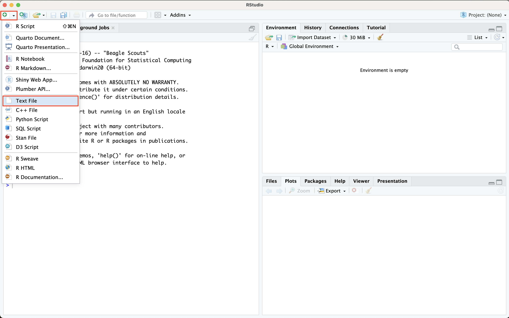
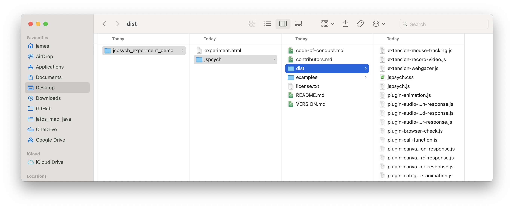
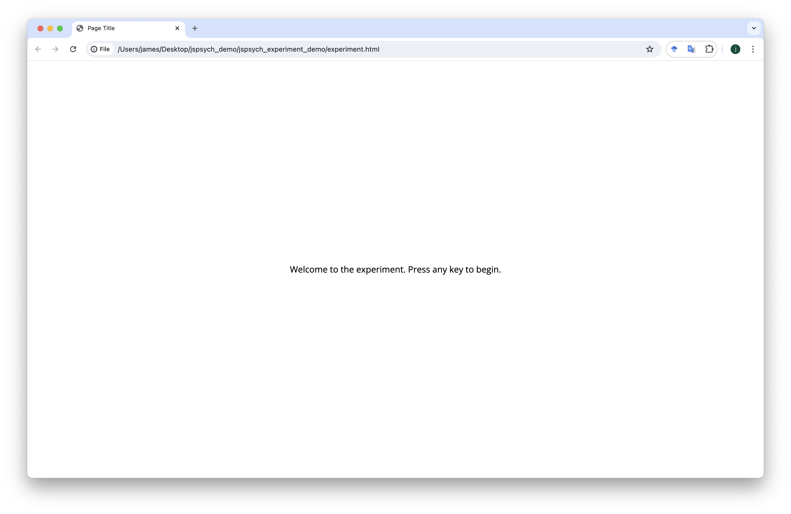

```{r echo=FALSE, warning=FALSE}
library(slickR)
library(htmltools)
library(xaringanExtra)
library(rmarkdown)
library(fontawesome)
library(bsplus)
library(DT)

```

```{r setup, warning=FALSE, echo=FALSE}
knitr::opts_chunk$set(echo = TRUE,
                      eval = FALSE,
                      comment = NA,
                      message = FALSE,
                      warning = FALSE)

knitr::knit_hooks$set(
  message = function(x, options) {
     paste('<button type="button" class="collapsible1"><strong>',
     fa(name = "circle-info"),
     ' more info</strong></button>', '<div class="content1"><p>',
     gsub('##', '\n', x),
     '</p></div>',
     sep = '\n')
   })

codeblock = function(x, options) {
     cat(paste('<div class="codeblock">',
     paste0(x),
     '</div>',
     sep = '\n'))
   }

```

---

## `r fa("language")` Translations available

Disclaimer: may not be very accurate...

<div id="google_translate_element"></div>

---

# Worksheet overview

## `r fa("crosshairs")` Aims

By the end of this worksheet you should be able to:

- **program** your own experiments in jsPsych
- **host** the experiment online using cognition.run
- **use** the participant data for analysis
- **apply** the basic skills you have learnt for your own purposes
- **learn** some extra skills such as HTML, javascript, CSS and JSON

## `r fa("user-graduate")` Pre-requisites

To complete the aims you will need to:

- **follow** this worksheet
- **ask** questions if you are not sure/be able to google
- **have** a working computer and internet connection
- **be patient** when things do not work

You do not need to:

- have any **programming knowledge**
- have high **computer literacy**
- know anything about **jsPsych, cognition.run, html, css or javascript**
- be a **linguist**

## `r fa("folder-tree")` Structure

The worksheet will go through the following sections:

    - working with randomisation
    - working with data
    - working with R to process your data

## `r fa("lightbulb")` Recap

In the last session we should have:

- Use audio and visual stimuli together
- preload our stimuli
- create a fully working experiment

---


# JsPsych without cognition.run

We will now be moving away from cognition.run as a platform for hosting and running experiments. This is largely because it is simply not as useful for more complex, larger or secure data collection.

There are some differences between how your code will look in cognition.run and how it will look when you are writing a normal JsPsych experiment.

Here is how a really simple experiment looks in cognition.run:

```{js}
// inititate jspsych
var jsPsych = initJsPsych();

// start timeline
timeline = [];

// define welcome message trial
var welcome = {
  type: jsPsychHtmlKeyboardResponse,
  stimulus: "Welcome to the experiment. Press any key to begin."
};

// push to timeline
timeline.push(welcome);

//run the experiment
jsPsych.run(timeline);

```

We do not need to load anything in to make this experiment work, this is because cognition.run does some of the important things in the background, meaning you do not have to write extra code.

However, in a normal JsPsych script things look a bit different.

# experiment.html

Firstly, we do not use an interface on the internet to run the experiment. Instead, we need to create a directory on our computer that will have all the required files to make the experiment run.

The first file you will need is a `.html`, which will contain most of your code. These types of files are normally how webpages are written, for example see https://www.w3schools.com/html/tryit.asp?filename=tryhtml_editor

But for a JsPsych experiment, we need to write the html file in a specific way, so that we can load in JsPsych, plugins, and other important aspects so that our code will work.

First, we need to create a `.html` file. There are lots of ways to do this, you can use a text editor like `atom` https://atom-editor.cc/, or if you want to keep things simple, we can use R.

Open RStudio and create a new `text file`:



Now create a folder somewhere on your computer and call it `jspsych_experiment_demo`, then save your text file in R as `experiment.html` in the folder. Now we can start writing our script.

A `.html` file needs the following basic structure:

```{html}
<!DOCTYPE html>
<html>
<head>
  <title>Page Title</title>
</head>
<body>
</body>

</html>

```

- `<!DOCTYPE html>`: This is the document type declaration, which informs the web browser that the document is an HTML5 document. It is not an HTML tag; it's an instruction to the browser.

- `<html>`: This is the opening tag of the HTML document. It indicates the start of the HTML document and encapsulates all the HTML content.

- `<head>`: This is the opening tag of the head section of the HTML document. The head section contains meta-information about the document, such as its title, links to stylesheets, and metadata.

- `<title>Page Title</title>`: This is a title element within the head section. It sets the title of the HTML document, which appears in the browser's title bar or tab.

- `</head>`: This is the closing tag of the head section. It indicates the end of the head section and the beginning of the body section.

- `<body>`: This is the opening tag of the body section of the HTML document. The body section contains the main content of the document, such as text, images, and other media.

- `</body>`: This is the closing tag of the body section. It indicates the end of the body section.

- `</html>`: This is the closing tag of the HTML document. It indicates the end of the HTML document.

# JsPsych scripts

In order for our experiment to work with JsPsych, we need to add some code so that the file can read in `scripts`. JsPsych has a specific set of files that are required to run an experiment, but first we need to download them.

You can download the folder containing these files JsPsych 7.3.4 at this link https://github.com/jspsych/jsPsych/releases/download/jspsych%407.3.4/jspsych.zip

They are also in the OneDrive folder `jspsych`.

Make sure you put this folder in the `jspsych_experiment_demo` folder on your computer.

Note, JsPsych is constantly being developed, so this version of the files may get updated over time. You can check on updates at the JsPsysch GitHub https://github.com/jspsych/jsPsych/releases. If you download these files and store them on your computer, they can be shared with your scripts, but make sure to write somewhere which version of JsPsych you are using.

Within the folder you will see a subfolder called `dist`, this has all the required files for a basic experiment to run.



- `jspsych.js` is the most important file, it allows all the basic functions of JsPsych to be used

- `jspsych.css` is the css styling file, it makes everything look a bit nicer than the default

- `plugin-___.js` are the plugin files, each plugin will have an individual file that needs to be loaded if being used in the experiment

To load these files we will add some code to our `experiment.html` file within the `<head>` tag. It will follow this format:

```{html}
<script src="filepath/filename.js"></script>

```

- `filepath` is the filepath for where the file we want to load is located. Our `experiment.html` file uses the folder it is located in as the root directory, i.e. you do not need to specify `desktop/my_files/jspsych/jspsych_experiment_demo/` you can just write `jspsych/dist/`

- `filename.js` is the name of the file you want to load, e.g. `jspsych.js`

So if we want to load in `jspsych.js` then we would use:

```{html}
<script src="jspsych/dist/jspsych.js"></script>

```

If we want to load in another file, we have to write the same code, but changing the filename. E.g. to load in the files `jspsych.js` and `plugin-html-keyboard-response.js` we would need to have:

```{html}
<script src="jspsych/dist/jspsych.js"></script>
<script src="jspsych/dist/plugin-html-keyboard-response.js"></script>

```

This is an important difference between cognition.run, as you need to know what plugins you are using and add the code that loads in the plugin from the individual file.

If we want to load in the css file `jspsych.css` then the code will look a little bit different, as it is not a `.js` file:

```{html}
<script src="jspsych/dist/jspsych.js"></script>
<script src="jspsych/dist/plugin-html-keyboard-response.js"></script>
<link href="jspsych/dist/jspsych.css" rel="stylesheet" type="text/css" />

```

Our `experiment.html` file should now look like this:

```{html}
<!DOCTYPE html>
<html>
<head>
  <title>Page Title</title>
  <script src="jspsych/dist/jspsych.js"></script>
  <script src="jspsych/dist/plugin-html-keyboard-response.js"></script>
  <link href="jspsych/dist/jspsych.css" rel="stylesheet" type="text/css" />
</head>
<body>
</body>

</html>

```

# JsPsych code

Now we can start writing in our JsPsych code.

Underneath the closing body tag `</body>` we need to write our own `script`, so we will add a script tag and then put some JsPsych code within the tag. Here we can just run a really simple experiment with the `jsPsychHtmlKeyboardResponse` plugin:

```{html}
<script>
  
// inititate jspsych
var jsPsych = initJsPsych();

// start timeline
timeline = [];

// define welcome message trial
var welcome = {
  type: jsPsychHtmlKeyboardResponse,
  stimulus: "Welcome to the experiment. Press any key to begin."
};

// push to timeline
timeline.push(welcome);

//run the experiment
jsPsych.run(timeline);

</script>

```

If you save the `experiment.html` file, and then open it in a web browser you should see that the experiment works.



Here is how your `experiment.html` file should look:

```{html}
<!DOCTYPE html>
<html>
<head>
  <title>Page Title</title>
  <script src="jspsych/dist/jspsych.js"></script>
  <script src="jspsych/dist/plugin-html-keyboard-response.js"></script>
  <link href="jspsych/dist/jspsych.css" rel="stylesheet" type="text/css" />
</head>
<body>
</body>

<script>

// inititate jspsych
var jsPsych = initJsPsych();

// start timeline
timeline = [];

// define welcome message trial
var welcome = {
  type: jsPsychHtmlKeyboardResponse,
  stimulus: "Welcome to the experiment. Press any key to begin."
};

// push to timeline
timeline.push(welcome);

//run the experiment
jsPsych.run(timeline);
  
</script>

</html>

```


```{r echo=FALSE, eval=TRUE, warning=FALSE}
htmltools::tags$script(src = "js/translate.js")
# htmltools::tags$script(src = "js/infobox.js")
htmltools::tags$script(src="//translate.google.com/translate_a/element.js?cb=googleTranslateElementInit")

htmltools::tagList(
  xaringanExtra::use_clipboard(
    button_text = "<i class=\"fa fa-clipboard\" style=\"font-size: 25px\"></i>",
    success_text = "<i class=\"fa fa-check\" style=\"color: #90BE6D; font-size: 25px\"></i>",
  ),
  rmarkdown::html_dependency_font_awesome()
)

```

```{js echo=FALSE, eval=TRUE}
var coll = document.getElementsByClassName("collapsible1");
var i;

for (i = 0; i < coll.length; i++) {
  coll[i].addEventListener("click", function() {
    this.classList.toggle("active1");
    var content = this.nextElementSibling;
    if (content.style.maxHeight){
      content.style.maxHeight = null;
    } else {
      content.style.maxHeight = content.scrollHeight + "px";
    }
  });
}

```
